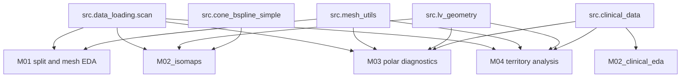

# M0 Notebooks and Source Python Catalog

**Project folder:** `lv-scar-segmentation/`  
**Notebook folder:** `lv-scar-segmentation/notebooks/`  
**Source folder:** `lv-scar-segmentation/src/`

This page is the quick index for all current `M0*.ipynb` notebooks and project `.py` source modules. It is the memory home for M01, M02 clinical, M02 isomaps, M03, M04, and every module under `src/`. Use the dedicated memory pages for deeper notes where available.

---

## M0 Notebooks

| Notebook | Purpose | Main outputs / notes |
|---|---|---|
| `M01_scar_exploration.ipynb` | Initial LV scar dataset scan, exploratory data checks, 80/20 split creation, and first 3-D scar/LV visualisations. | Creates/uses `results/split.json`; see `../notebooks/M01_scar_exploration.md`. |
| `M02_clinical_eda.ipynb` | Clinical registry exploration: completeness, demographics, scar clinical variables, risk factors, echo/device/arrhythmia/follow-up summaries, correlations, and subgroup comparisons. | Depends on `src.clinical_data.load()` and the clinical CSV. Produces EDA tables/figures for population characterization. |
| `M02_isomaps.ipynb` | Intrinsic 2-D shape analysis of connected CZ scar fragments using ISOMAP-style embeddings after fragment filtering. | Runs on the known split; produces embedding grids, 3-D fragment vs 2-D diagnostic views, and fragmentation summaries. See `../pipelines/isomap_pipeline.md`. |
| `M03_polar_diagnostics.ipynb` | Polar-map orientation validation and projection comparison. Covers D1-D6 axis/septal diagnostics, all-case bull's-eye maps, QC checks, vertex/area/coverage comparisons, AHA summaries, and ring coverage plots. | Main output folder: `results/06_polar_diagnostics/`; see `../notebooks/M03_polar_diagnostics.md`. |
| `M04_scar_analysis.ipynb` | Coronary-territory scar analysis using polar maps and AHA territory grouping. Includes territory burden, population distributions, age correlations, sex differences, ANOVA, and dominant territory summaries. | Builds on M03-style polar geometry plus clinical sex/age labels. |

---

## Notebook Details

### M01 — Scar Exploration

Primary workflow:

1. Import configuration and dataset paths.
2. Scan the ADAS3D dataset with `src.data_loading.scan()`.
3. Explore case availability and mesh/tissue completeness.
4. Create the known 80/20 split used downstream.
5. Render 3-D LV and scar visual checks, including a per-patient grid.

Important memory page: `../notebooks/M01_scar_exploration.md`.

### M02 — Clinical EDA

Primary workflow:

1. Load the clinical registry through `src.clinical_data.load()`.
2. Inspect dataset dimensions, missingness, and most complete columns.
3. Check numeric outliers against patient row index.
4. Summarize categorical/binary fields including unknown values.
5. Characterize demographics, MRI scar variables, risk factors, infarction/revascularization history, cardiac structure/function, devices, ventricular arrhythmias, and follow-up outcomes.
6. Build numeric correlation matrices and subgroup comparisons.

Key dependency: `src/clinical_data.py`, especially `COLUMN_GROUPS`, type casting, and categorical sex labels.

### M02 — ISOMAP Shape Analysis

Primary workflow:

1. Load known cases from the split.
2. Split CZ scar into connected fragments.
3. Filter tiny fragments while keeping at least one fragment per case.
4. Embed or normalize scar fragment shape in 2-D.
5. Render embedding grids and 3-D-vs-2-D diagnostic panels.
6. Summarize fragmentation counts and largest-fragment dominance.

Important memory page: `../pipelines/isomap_pipeline.md`.

### M03 — Polar Diagnostics

Primary workflow:

1. Load known cases, LV shell, CZ mesh, RV mesh, and clinical sex labels.
2. Validate septal/RV reference methods and long-axis orientation.
3. Generate polar maps using apex-to-base `s` and circumferential `theta`.
4. Run QC panels for axis, longitudinal coordinate, circumferential coordinate, and PCA-vs-RV reference agreement.
5. Compare vertex presence, CZ area, and CZ/LV surface-normalized coverage.
6. Summarize population density, AHA-17 segments, and ring-level CZ/LV coverage.

Important memory page: `../notebooks/M03_polar_diagnostics.md`.

### M04 — Coronary Territory Scar Analysis

Primary workflow:

1. Load project paths, known cases, and clinical labels for sex and age.
2. Compute polar maps for Core Zone scar burden.
3. Define the AHA segment grid and map segments into coronary territories.
4. Compute per-patient territory scar burden.
5. Plot population-level territory distributions and a mean polar map with territory overlay.
6. Test age correlations against total scar and multi-territory involvement.
7. Compare territory burden by sex, including within-sex territory ANOVA and dominant-territory summaries.

Conceptual dependency: M03's polar-map coordinate convention and AHA segmentation logic.

---

## Source Python Modules

| Module | Role | Key public API |
|---|---|---|
| `src/__init__.py` | Package marker for `src`. | No public functions. |
| `src/clinical_data.py` | Clinical CSV loader and registry schema normalizer. | `load()`, `summary()`, `available_columns()`, `COLUMN_GROUPS`, `CATEGORICAL_LABELS`, `CLINICAL_REVIEW_NOTES`. |
| `src/data_loading.py` | ADAS3D dataset scanner for LV/RV anatomy, tissue surfaces, layers, and stats CSVs. | `PatientCase`, `scan()`, `diagnose()`. |
| `src/mesh_utils.py` | PyVista mesh loading helpers and CZ connected-component filtering. | `best_shell()`, `get_cz_mesh()`, `best_rv_mesh()`, `connected_fragments()`, `filter_fragments()`. |
| `src/lv_geometry.py` | Shared LV long-axis, septal reference, transform, and polar projection geometry. | `long_axis()`, `long_axis_qc()`, `plane_basis()`, `rv_reference_pca()`, `rv_reference_from_rv_mesh()`, `compute_transform()`, `apply_transform()`, `prepare_polar_geometry()`, `project_points_to_polar()`, `polar_mask()`. |
| `src/cone_bspline_simple.py` | Cone/polar scar shape representation and closed B-spline fitting for whole scar and connected fragments. | `SplineFit2D`, `CaseConeSplineResult`, `polar_to_cone_xy()`, `build_case_cone_splines()`. |

---

## Module Details

### `clinical_data.py`

Loads the study's patient-level registry CSV, handling encoding detection, delimiter inference, Spanish header normalization, duplicate header disambiguation, date parsing, decimal-comma numeric fields, nullable integer flags, NYHA parsing, and `channels` text/numeric conversion.

Column organization:

| Group | Content |
|---|---|
| `demographics` | `patient_id`, birth date, age, sex |
| `risk_factors` | HTA, DLP, DM, smoking, AFIB, NYHA, MI |
| `scar_geometry` | LV mass, BZ/Core mass and percentages, channels, enhancement fields |
| `echo` | LVEF, LV dimensions/volumes, LA, septum, posterior wall |
| `devices` | Device carrier/type, ICD prevention, biomonitor |
| `arrhythmias` | Clinical/inducible VA, PVC burden, ICD therapies, ablation |
| `followup` | 6-month events, VA, death fields, NYHA class |
| `medications` | ACEi/ARB/BB/spiro/furosemide/digoxin/amiodarone |

Caveat: several clinical code meanings are marked for clinical review, especially enhancement distribution/grade and some arrhythmia source fields.

### `data_loading.py`

Scans the external ADAS3D folder structure:

```text
<root>/<year>/<patient_id>/Basal/Data/<DE-MRI variant>/LV/
```

It tries `DE-MRI`, `DE-MRI 3D`, and `DE-MRI 2D` in order. It resolves LV anatomy files, RV anatomy when present, recursive tissue-surface globs, `Layer_*.vtk`, and tissue CSVs. The returned `PatientCase` stores resolved paths, not loaded meshes.

Use `diagnose(case)` when a patient has missing surfaces or unexpected file names.

### `mesh_utils.py`

Provides lightweight PyVista mesh access and small mesh-processing helpers. The functions operate on `PatientCase` objects produced by `src.data_loading.scan()`: `data_loading.py` resolves file paths, while `mesh_utils.py` actually loads PyVista meshes from those paths.

| Function | Behavior |
|---|---|
| `best_shell(case)` | Loads the preferred LV shell using priority `lv`, `myocardium`, `endo`, `epi`; returns `None` if no candidate path exists. |
| `get_cz_mesh(case)` | Loads the Core Zone scar mesh from `case.tissue_surfaces["core"]`; returns `None` if missing. |
| `best_rv_mesh(case)` | Loads the preferred RV mesh using priority `rv`, `rv_endo`, `rv_epi`; supports both current `case.rv_anatomy` and older anatomy fallback. |
| `connected_fragments(mesh)` | Splits a PyVista mesh into connected surface fragments using `mesh.connectivity(largest=False)`, extracts each region, cleans it, and sorts fragments largest first. |
| `filter_fragments(fragments, min_points=30)` | Drops tiny fragments below `min_points`, while always keeping at least one fragment if any exist. |

Actual usage in the M notebooks:

| Notebook | `mesh_utils.py` usage |
|---|---|
| `M01_scar_exploration.ipynb` | Imports `best_shell as _best_shell` and `get_cz_mesh`; calls `_best_shell(case)` once and `get_cz_mesh(case)` once for the 3-D scar/LV visualisation grid. |
| `M02_clinical_eda.ipynb` | Not used. Clinical EDA works on registry tables, not meshes. |
| `M02_isomaps.ipynb` | Not imported. It defines local duplicate helpers named `_best_shell`, `_connected_fragments`, and `_filter_fragments`, so it should not be counted as using `src.mesh_utils.py`. |
| `M03_polar_diagnostics.ipynb` | Imports `best_shell`, `get_cz_mesh`, and `best_rv_mesh`; actual calls: `best_shell` 20, `get_cz_mesh` 10, `best_rv_mesh` 17. Used across case filtering, D1-D6 diagnostics, polar-map construction, QC, vertex-count ring coverage, and area/coverage maps. |
| `M04_scar_analysis.ipynb` | Imports `best_shell`, `get_cz_mesh`, and `best_rv_mesh`; actual calls: `best_shell` 3, `get_cz_mesh` 1, `best_rv_mesh` 2. Used for known-case filtering and polar-map computation. |

Interpretation: `mesh_utils.py` is active project infrastructure for M01, M03, and M04. M02 isomaps should eventually be refactored to reuse `mesh_utils.py` instead of keeping local duplicate helper definitions.

### `lv_geometry.py`

Central geometry module for the project. It computes the robust LV long axis, apex, septal/RV reference, coordinate transforms, and polar-map projection coordinates.

Important conventions:

| Concept | Convention |
|---|---|
| Long axis | Returned as apex-to-base direction. |
| Apex | Chosen from convex-hull candidates with highest eccentricity. |
| RV-aware axis | If RV mesh is available, RV SVD PC1 is tried before LV PC1/PC2 candidates. |
| Septal reference | Either basal-ring PCA fallback or RV centroid direction in the basal band. |
| Polar coordinates | `theta` is circumferential angle relative to septal reference; `s` is normalized apex-to-base coordinate. |

`polar_mask()` includes a horizontal flip and optional display roll for AHA-style bull's-eye orientation. Some notebooks also apply a clockwise theta flip before binning, so always check the local caller before changing orientation logic.

### `cone_bspline_simple.py`

Builds a 2-D cone-plane representation of scar using:

```python
x = s * cos(theta)
y = s * sin(theta)
```

It fits:

| Fit | Method |
|---|---|
| Whole scar envelope | Rasterize CZ points, close/fill the mask, trace boundary pixels, then fit a closed B-spline. |
| Fragment boundaries | Split CZ into connected fragments, compute alpha-shape-like concave boundary where possible, fall back to convex hull, then fit a closed B-spline. |

Returned `CaseConeSplineResult` includes the whole fit, per-fragment fits, raw/kept/dropped fragment counts, and largest-fragment fraction.

---

## Cross-Notebook Dependency Map



---

## Current Coverage Status

| File | Memory coverage |
|---|---|
| `M01_scar_exploration.ipynb` | Dedicated page plus this catalog |
| `M02_clinical_eda.ipynb` | This catalog |
| `M02_isomaps.ipynb` | Dedicated ISOMAP page plus this catalog |
| `M03_polar_diagnostics.ipynb` | Dedicated page plus this catalog |
| `M04_scar_analysis.ipynb` | This catalog |
| `src/*.py` | This catalog |
